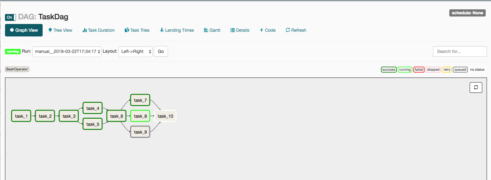
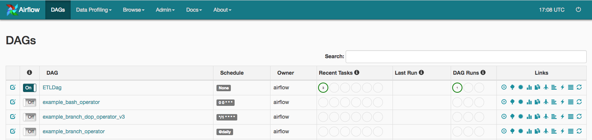

```{r setup, include=FALSE}
knitr::opts_chunk$set(echo = FALSE)
```

## About Me

Senior Data Analyst at Socrata

Used Airflow in both production and personal projects

Recent San Diego transplant (so any recommendations - especially good hiking spots - are welcomed!)

## What is Airflow

> "Airflow is a platform to programmatically author, schedule and monitor workflows."

- Initially designed at AirBnB
- Apache Incubator
- Strong and active open source community + good documentation
- So much more than just a DAG scheduler
- Really good UI

> "When workflows are defined as code, they become more maintainable, versionable, testable, and collaborative."

## Airflow Setup

```bash
$ pip install apache-airflow
```
```bash
$ airflow initdb
```
```bash
$ cd ~/airflow/
```

and a shout out (for when things go awry):
```bash
$ airflow resetdb
```


## Anatomy of a DAG: What's a dag?
**D**irected **A**cyclic **G**raph

> "A collection of all the tasks you want to run, organized in a way that reflects their relationships and dependencies."

```{r, out.width = "100%", out.height="100%"}

```


## Anatomy of a DAG: Boilerplate
```py
import airflow
from airflow.operators.bash_operator import BashOperator
from airflow.models import DAG
```
```py
args = {
    'owner': 'airflow',
    'start_date': airflow.utils.dates.days_ago(1)
    'depends_on_past': False,
    'email': ['airflow@airflow.com'],
    'email_on_failure': False,
    'email_on_retry': False,
    'retries': 1,
    'retry_delay': timedelta(minutes=5),
}

dag = DAG(dag_id='ETLDag', default_args=args, 
  schedule_interval="0 14 * * *") 
# you can use @daily, timedelta(1), None, and others
```
## Anatomy of a DAG: The tasks
```py
extract = " python Extract.py"
run_this_first = BashOperator(
    task_id='extract',
    bash_command=extract,
    dag=dag)
    
transform = " python Transform.py"
run_this_second = BashOperator(
    task_id='transform',
    bash_command=transform,
    dag=dag)
    
load = " python Load.py"
run_this_last = BashOperator(
    task_id='load',
    bash_command=load,
    dag=dag)
    
run_this_first >> run_this_second >> run_this_last
```
## Scheduling a DAG
```bash
$ airflow webserver -D
```
```bash
$ airflow scheduler -D
```
__note:__ 

don't for get to flip your DAG "on" (or change airflow.cfg to be on by default)
```{r, out.width = "100%", out.height="100%"}

```
[localhost:8080](http://localhost:8080)

## Extending Airflow

* Concurrent tasks
    - MySQL / PostGRES
    - Clusters
- Celery (and message queue integration)
- AWS, GoogleCloud, Azure
- Docker
- REST API
- Data Science (dependency management)
- SensorOperator

## Other Tools to Checkout

- Luigi : (Spotify) Python based task management

- Pinball: (Pintrest) workflow management tool in python

## Thank you!

Questions? Comments? Concerns?